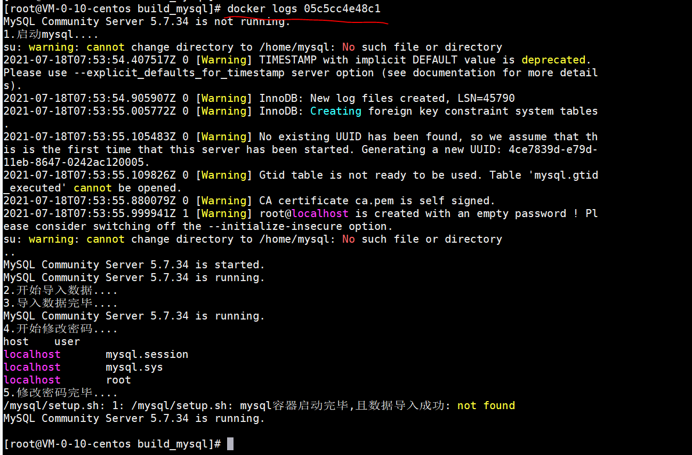
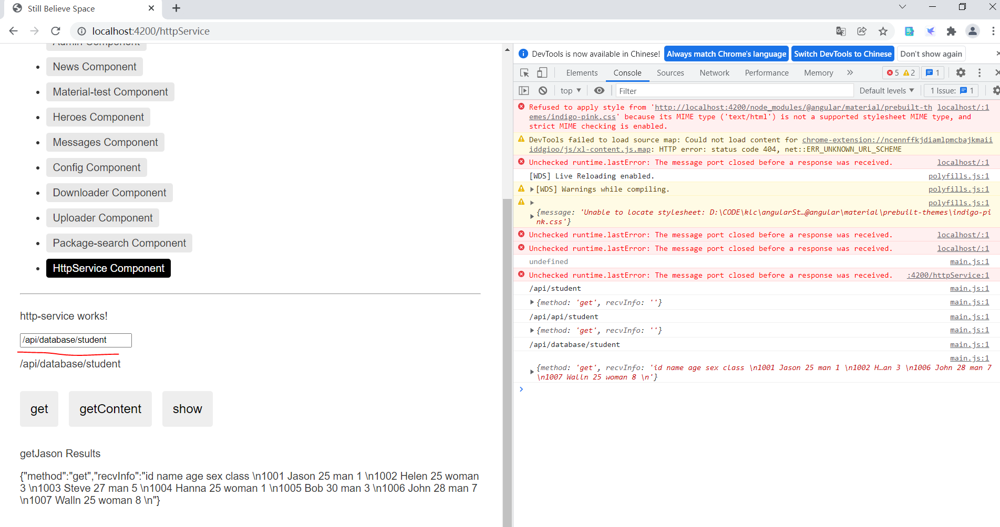

# Docker实践 - mysql容器搭建

[[toc]]

> 用于记录mysql容器搭建内容

# 参考资料

* [详解利用Dockerfile构建mysql镜像并实现数据的初始化及权限设置](https://www.cnblogs.com/zknublx/p/9303231.html)
* [使用Docker搭建MySQL服务](https://www.cnblogs.com/sablier/p/11605606.html)

# 基础使用

## 获取MySQL镜像

**拉取官方镜像**（我们这里选择5.7，如果不写后面的版本号则会自动拉取最新版）

* [MySQL文档地址](https://hub.docker.com/_/mysql/)

```bash
docker pull mysql:5.7   # 拉取 mysql 5.7
docker pull mysql       # 拉取最新版mysql镜像
```

**检查是否拉取成功**

```bash
[root@VM-0-10-centos ~]# docker images |grep mysql
docker.io/mysql             5.7                 87eca374c0ed        13 days ago         447 MB
```

**一般来说数据库容器不需要建立目录映射：**

```bash
sudo docker run -p 3306:3306 --name mysql -e MYSQL_ROOT_PASSWORD=123456 -d mysql:5.7
```

**详细说明：**
```
–name：容器名，此处命名为mysql
-e：配置信息，此处配置mysql的root用户的登陆密码
-p：端口映射，此处映射 主机3306端口 到 容器的3306端口
-d：后台运行容器，保证在退出终端后容器继续运行
```

**如果要建立目录映射：**
```
sudo docker run -p 3306:3306 --name mysql \
-v /usr/local/docker/mysql/conf:/etc/mysql \
-v /usr/local/docker/mysql/logs:/var/log/mysql \
-v /usr/local/docker/mysql/data:/var/lib/mysql \
-e MYSQL_ROOT_PASSWORD=123456 \
-d mysql:5.7
-v：主机和容器的目录映射关系，":"前为主机目录，之后为容器目录
```

**检查容器是否正确运行**

```bash
[root@VM-0-10-centos ~]# docker ps |grep mysql
7ef20e63c516        mysql:5.7                        "docker-entrypoint..."   25 minutes ago      Up 25 minutes       33060/tcp, 0.0.0.0:3307->3306/tcp                  mysql

```
可以看到容器ID，容器的源镜像，启动命令，创建时间，状态，端口映射信息，容器名字。

## 连接mysql

**进入docker本地连接mysql客户端：**
```bash
sudo docker exec -it mysql bash
mysql -uroot -p123456
```

**使用远程连接软件时要注意一个问题**

我们在创建容器的时候已经将容器的3307端口和主机的3306端口映射到一起，所以我们应该访问：

```bash
mysql -h 127.0.0.1  -u root -P 3307 -p123456
```

## 问题记录：

如果你的容器运行正常，但是无法访问到MySQL，一般有以下几个可能的原因：

防火墙阻拦

**开放端口：**
```
$ systemctl status firewalld
$ firewall-cmd  --zone=public --add-port=3307/tcp -permanent
$ firewall-cmd  --reload
# 关闭防火墙：
$ sudo systemctl stop firewalld
```

**需要进入docker本地客户端设置远程访问账号**
```
$ sudo docker exec -it mysql bash
$ mysql -uroot -p123456
mysql> grant all privileges on *.* to root@'%' identified by "password";
grant all privileges on *.* to root@'%' identified by 123456;
```

**原理：**
* mysql使用mysql数据库中的user表来管理权限，修改user表就可以修改权限（只有root账号可以修改）

```
mysql> use mysql;
Database changed

mysql> select host,user,password from user;
+--------------+------+-------------------------------------------+
| host                    | user      | password                                                                 |
+--------------+------+-------------------------------------------+
| localhost              | root     | *A731AEBFB621E354CD41BAF207D884A609E81F5E      |
| 192.168.1.1            | root     | *A731AEBFB621E354CD41BAF207D884A609E81F5E      |
+--------------+------+-------------------------------------------+
2 rows in set (0.00 sec)

mysql> grant all privileges  on *.* to root@'%' identified by "password";
Query OK, 0 rows affected (0.00 sec)

mysql> flush privileges;
Query OK, 0 rows affected (0.00 sec)

mysql> select host,user,password from user;
+--------------+------+-------------------------------------------+
| host                    | user      | password                                                                 |
+--------------+------+-------------------------------------------+
| localhost              | root      | *A731AEBFB621E354CD41BAF207D884A609E81F5E     |
| 192.168.1.1            | root      | *A731AEBFB621E354CD41BAF207D884A609E81F5E     |
| %                       | root      | *A731AEBFB621E354CD41BAF207D884A609E81F5E     |
+--------------+------+-------------------------------------------+
3 rows in set (0.00 sec)
```

# docker-compose搭建过程,包含一些内置库数据

https://www.runoob.com/docker/docker-compose.html
https://github.com/sprintcube/docker-compose-lamp

可以用curl 127.0.0.1:3308测试

源文件

```
[root@VM-0-10-centos build_mysql]# tree
.
|-- Dockerfile      ————Dockerfile源文件
|-- privileges.sql	————权限设置脚本
|-- schema.sql		————建表脚本1
|-- student.sql		————建表脚本2
`-- setup.sh		————容器启动运行脚本
```

**1.Dockerfile详细内容：**

```
FROM mysql:5.7

#设置免密登录
ENV MYSQL_ALLOW_EMPTY_PASSWORD yes

#将所需文件放到容器中
COPY setup.sh /mysql/setup.sh
COPY schema.sql /mysql/schema.sql
COPY student.sql /mysql/student.sql
COPY privileges.sql /mysql/privileges.sql

#设置容器启动时执行的命令
CMD ["sh", "/mysql/setup.sh"]
```

**2.容器启动脚本**

```bash
#!/bin/bash
set -e
 
#查看mysql服务的状态，方便调试，这条语句可以删除
echo `service mysql status`
 
echo '1.启动mysql....'
#启动mysql
service mysql start
sleep 3
echo `service mysql status`
 
echo '2.开始导入数据....'
#导入数据
mysql < /mysql/schema.sql
mysql < /mysql/student.sql
echo '3.导入数据完毕....'
 
sleep 3
echo `service mysql status`
 
#重新设置mysql密码
echo '4.开始修改密码....'
mysql < /mysql/privileges.sql
echo '5.修改密码完毕....'
 
#sleep 3
echo `service mysql status`
echo `mysql容器启动完毕,且数据导入成功`
 
tail -f /dev/null
```

这里是先导入数据，然后才是设置用户和权限，是因为mysql容器一开始为免密登录，Dockerfile中有如下设置：`ENV MYSQL_ALLOW_EMPTY_PASSWORD yes`,此时执行导入数据命令不需要登录验证操作，如果是先执行权限操作，那么导入数据则需要登录验证，整个过程就麻烦了许多。

**3、需要导入数据的mysql脚本命令schema.sql,不同的数据库通过不同的建表脚本来写，后期可以考虑create_table,init_table,update_table，分别写建表、初始化数据、升级等。**

docker_mysql数据库：

```sql
-- 创建数据库
create database `docker_mysql` default character set utf8 collate utf8_general_ci;
 
use docker_mysql;
 
-- 建表
DROP TABLE IF EXISTS `user`;
 
CREATE TABLE `user` (
 `id` bigint(20) NOT NULL,
 `created_at` bigint(40) DEFAULT NULL,
 `last_modified` bigint(40) DEFAULT NULL,
 `email` varchar(255) DEFAULT NULL,
 `first_name` varchar(255) DEFAULT NULL,
 `last_name` varchar(255) DEFAULT NULL,
 `username` varchar(255) DEFAULT NULL,
 PRIMARY KEY (`id`)
) ENGINE=InnoDB DEFAULT CHARSET=latin1;
 
-- 插入数据
INSERT INTO `user` (`id`, `created_at`, `last_modified`, `email`, `first_name`, `last_name`, `username`)
VALUES
  (0,1490257904,1490257904,'john.doe@example.com','John','Doe','user');
```

student数据库：

```sql
-- 创建数据库
create database `student` default character set utf8 collate utf8_general_ci;
 
use student;

-- 建表
DROP TABLE IF EXISTS `student`;

CREATE TABLE `student` (
  `id` int(11) NOT NULL,
  `name` varchar(30) DEFAULT NULL,
  `age` int(11) DEFAULT NULL,
  `sex` enum('man','woman') DEFAULT NULL,
  `class` int(10) DEFAULT NULL,
  PRIMARY KEY (`id`)
);

-- 插入数据
INSERT INTO `student` VALUES (1001, 'Jason', 25, 'man', 1);
INSERT INTO `student` VALUES (1002, 'Helen', 25, 'woman', 3);
INSERT INTO `student` VALUES (1003, 'Steve', 27, 'man', 5);
INSERT INTO `student` VALUES (1004, 'Hanna', 25, 'woman', 1);
INSERT INTO `student` VALUES (1005, 'Bob', 26, 'man', 3);
INSERT INTO `student` VALUES (1006, 'John', 28, 'man', 7);
INSERT INTO `student` VALUES (1007, 'Walln', 25, 'woman', 8);

```

**4、mysql权限设置命令privileges.sql，进行分角色权限控制，给不同的用户以不同的权限。**

```sql
use mysql;
select host, user from user;
-- 因为mysql版本是5.7，因此新建用户为如下命令：
create user docker identified by '123456';
-- 将docker_mysql数据库的权限授权给创建的docker用户，密码为123456：
grant all on docker_mysql.* to docker@'%' identified by '123456' with grant option;
-- 将所有数据库的权限授权给root用户，密码为123456：
grant all privileges on *.* to root@'%' identified by "123456";
-- 这一条命令一定要有：
flush privileges;
```

**5、创建镜像,在源文件所在路径下，执行以下命令：**

```bash
docker build -t docker-mysql .
```

**6、启动容器,并将端口映射到本地的3307端口：**

```bash
docker run -d -p 3307:3306 docker-mysql
```

命令行如下：


查看容器的日志记录，启动过程与启动脚本setup.sh中所规范的步骤一致，数据导入和权限设置成功：



**7、验证结果：**


## 项目搭建

所需文件:
```lua
|-- build_mysql.sh
|-- Dockerfile
|-- setup.sh
`-- sql
    |-- docker_mysql
    |   |-- create_table.sql
    |   |-- init_data.sql
    |   `-- update_data.sql
    |-- privileges
    |   `-- privileges.sql
    `-- student
        |-- create_table.sql
        |-- init_data.sql
        `-- update_data.sql

```

制作镜像
```
切到所在文件目录，直接执行./build_mysql.sh
```

angular界面查询指令：

```
/api/database/student
```




GRANT ALL ON *.* TO 'root'@'%';
flush privileges;
ALTER USER 'root'@'localhost' IDENTIFIED BY '456789' PASSWORD EXPIRE NEVER;
ALTER USER 'root'@'%' IDENTIFIED WITH mysql_native_password BY '456789';
flush privileges;

https://blog.csdn.net/sinat_34974437/article/details/104431289
